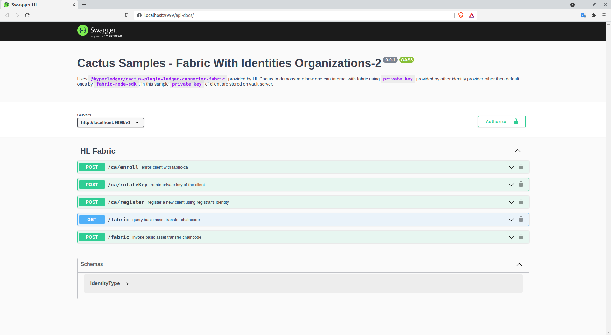

# Fabric With Identities

Uses `@hyperledger/cactus-plugin-ledger-connector-fabric` provided by HL Cactus to demonstrate how one can interact with fabric using `private key` provided by other identity provider other then default ones by `fabric-node-sdk`. In this sample `private key` of client are stored on vault server.

- [Fabric With Identities](#fabric-with-identities)
  - [Vault Server](#vault-server)
  - [Demo](#demo)
    - [Enroll](#enroll)


## Vault Server

For this demo , dev vault server is being used and we highly recommend NOT BE USED IN PRODUCTION. VISIT https://learn.hashicorp.com/tutorials/vault/deployment-guide FOR PROPER DEPLOYMENT OF HASHICORP VAULT.

```cmd
> docker run --rm --name vault -d \
    --cap-add=IPC_LOCK \
    -p 8200:8200 \
    -e 'VAULT_DEV_ROOT_TOKEN_ID=tokenId' \
    -e 'VAULT_DEV_LISTEN_ADDRESS=0.0.0.0:8200' vault:1.8.1


> docker exec -e VAULT_TOKEN=tokenId -e VAULT_ADDR=http://0.0.0.0:8200 -it vault vault secrets enable transit
```

This will start a development vault server with transit secret engine mounted at `/transit` and root token = `tokenId`

## Demo


- Build the application : `npm run build`

- Start The Demo server either as `Organization 1` or `Organization 2`

```cmd
  ORG_NAME={org1||org2} npm run start

  eg 
  > ORG_NAME=org2 npm run start
```

- Swagger UI Will be open at : http://localhost:9999/api-docs


<details>
    <summary>Swagger UI</summary>
    
</details>

- Create Two key inside vault engine

```
> curl --header "X-Vault-Token: tokenId" --request POST --data '{"type" : "ecdsa-p256"}' http://127.0.0.1:8200/v1/transit/keys/admin
> curl --header "X-Vault-Token: tokenId" --request POST --data '{"type" : "ecdsa-p384"}' http://127.0.0.1:8200/v1/transit/keys/client1
```

### Enroll

TODO